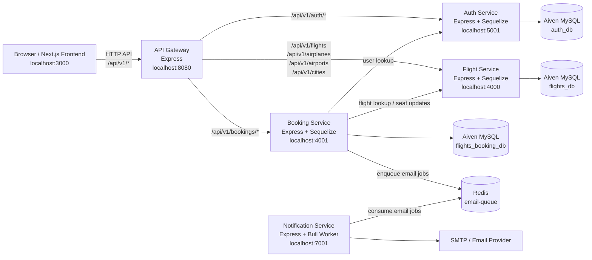

# Flight Booking App

Microservice-based flight booking application with a Next.js frontend, an Express API gateway, and separate backend services for auth, flights, bookings, and notifications.

## Local Development

Start all backend services from the backend root:

```bash
cd backend
npm run dev:fresh
```

Start the frontend separately:

```bash
cd frontend
npm run dev
```

Local service URLs:

| Service | URL |
|---|---|
| Frontend | `http://localhost:3000` |
| API Gateway | `http://localhost:8080` |
| Flight Service | `http://localhost:4000` |
| Booking Service | `http://localhost:4001` |
| Auth Service | `http://localhost:5001` |
| Notification Service | `http://localhost:7001` |

Use `http://localhost:8080` for frontend API calls. Chrome blocks port `6000` as unsafe, so do not use it for browser-facing APIs.

## Backend Architecture



## Environment

Backend services share one local env file:

```text
backend/.env
```

Frontend uses:

```text
frontend/.env.local
```

See `.env.example` for the expected variables.
